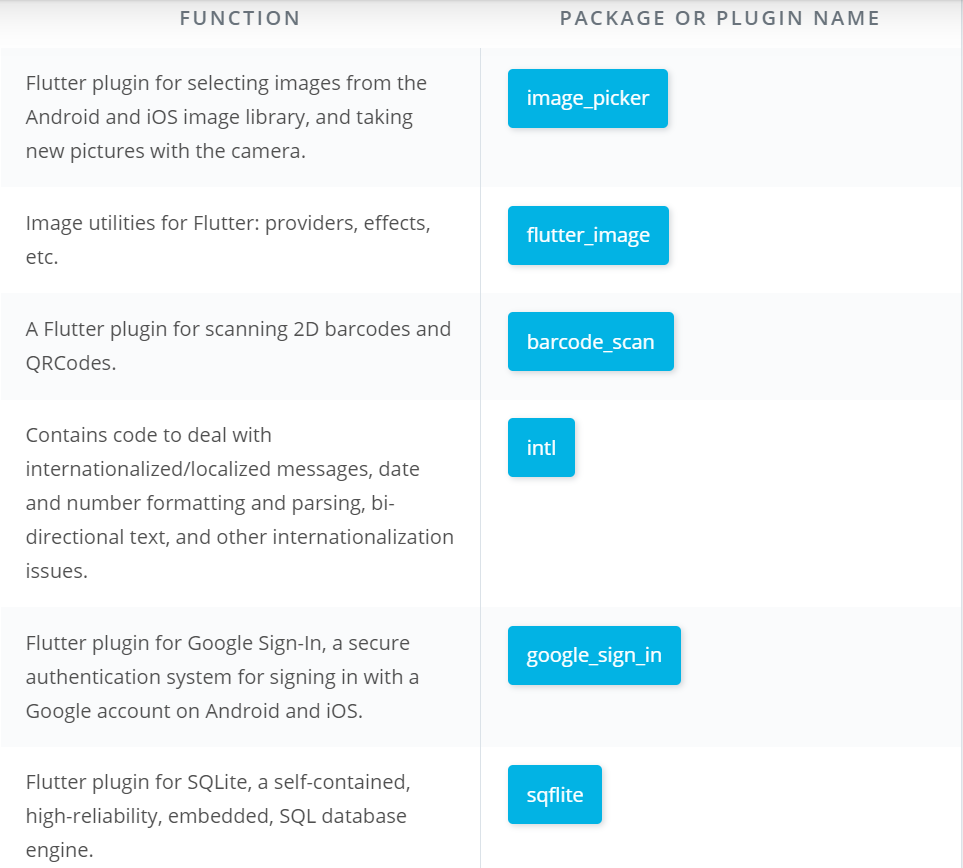
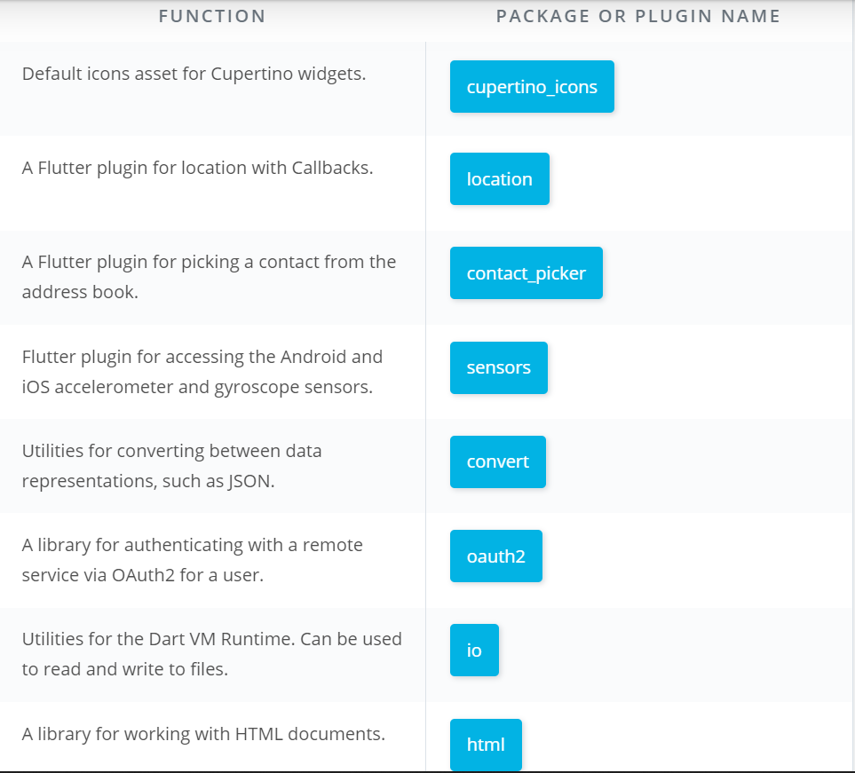

# Flutter Programing Guide & Resources

# Flutter Resources

<li> Documentation: https://docs.flutter.io/ </li>
<li> Dartpad: https://dartpad.dev </li>
<li> Github: https://github.com/flutter/flutter
<li> StackOverflow: https://stackoverflow.com/questions/tagged/flutter
<li> Gitter: https://gitter.im/flutter/flutter
<li> Effective Dart Guide: https://www.dartlang.org/guides/language/effective-dart
<li> Dart Tips: https://www.dartlang.org/resources/dart-tips
<li> Flutter FAQ: https://flutter.io/faq/
<li> Flutter Rendering: https://www.youtube.com/watch?v=UUfXWzp0-DU
<li> Flutter Engine: https://github.com/flutter/engine/wiki
<li> Hot Reload: https://flutter.io/hot-reload/
<li> Flutter Inspector: https://dart-lang.github.io/observatory/
<li> Dart Style Guide: https://www.dartlang.org/guides/language/effective-dart/style
<li> Dart Observatory: https://dart-lang.github.io/observatory/
<li> Flutter Widgets: https://flutter.io/widgets/
<li> Flutter Gallery App Code: https://github.com/flutter/flutter/tree/master/examples/flutter_gallery
<li> Flutter Gallery Android App: https://play.google.com/store/apps/details?id=io.flutter.demo.gallery
<li> Flutter Layout: https://flutter.io/tutorials/layout/
<li> Material: https://material.io
<li> Icons: https://thenounproject.com
<li> Icons: https://icons8.com/icons/ios-glyphs
<li> Images: https://unsplash.com
<li> Fonts: https://fonts.google.com
<li> Google APIs: https://pub.dartlang.org/packages/googleapis
<li> Async and Futures: https://www.dartlang.org/tutorials/language/futures
<li> Testing: https://flutter.io/testing/</li>

  # Flutter Courses
  
<li> Appbrewery - https://www.appbrewery.co/courses/548873/lectures/9985809
<li> Udacity https://classroom.udacity.com/courses/ud905 </li>

 # There's also plenty of other resources to help you on the web. Here are some of my favourites:

 <li> <a href="https://www.youtube.com/watch?v=yr8F2S3Amas&list=PLOU2XLYxmsIK0r_D-zWcmJ1plIcDNnRkK&index=1">The Boring Show - The official Flutter Developer Youtube series created by the Google Flutter team.</a>
 
 <li> <a href="https://www.udacity.com/course/build-native-mobile-apps-with-flutter--ud905">Build Native Mobile Apps with Flutter - This is a free Udacity course created by the Google Flutter team.</a>

 <li> <a href="https://flutter.dev/docs/codelabs">Flutter Docs - While I can't recommend most docs as a learning resource, I would make an exception for the Flutter Docs. They are really great not just as a reference but as a study aid. I especially recommend the Codelabs.</a>

 <li> <a href="https://itsallwidgets.com/">It's All Widgets - Published apps made with Flutter</a>

 <li> <a href="https://flutter-widget.live/basics/introduction">Flutter Widget Livebook - A live, animated reference of Flutter Widges</a>

 <li> <a href="https://gitter.im/flutter/flutter">Flutter Gitter - The Flutter Community in Gitter chat.</a>

 <li> <a href="https://flutterevents.com/">Flutter Events - Find a mentor, get in touch with your local Flutter community and learn new things you can do with Flutter by going to a Flutter event near you.</a>
</li>

# Important Flutter PACKAGE OR PLUGIN NAME

